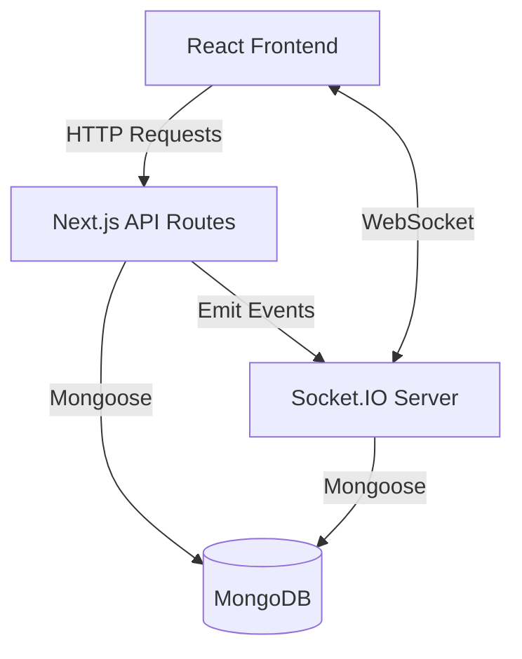
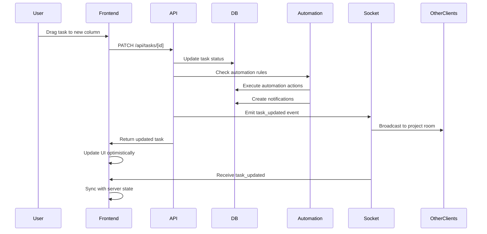
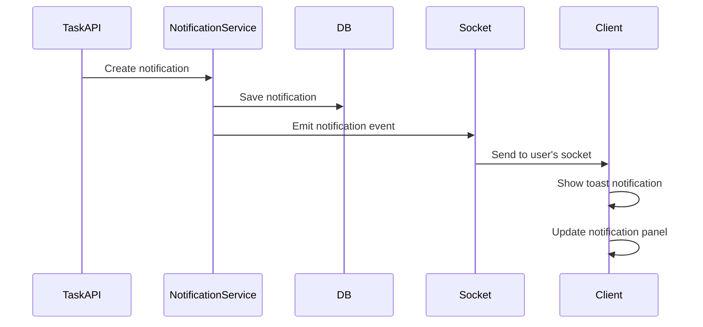

# Design Document

## Overview

This design document outlines the architecture for a project and task management system built on Next.js 16 with MongoDB, Socket.IO for real-time features, and React Query for state management. The system follows a RESTful API pattern with WebSocket integration for real-time notifications and Kanban board updates.

The application leverages the existing authentication infrastructure and extends it with new models for Projects, Tasks, Automations, and Notifications. The frontend uses React 19 with Tailwind CSS for styling, @hello-pangea/dnd for drag-and-drop functionality, and React Hook Form with Yup for form validation.

## Architecture

### High-Level Architecture



### Technology Stack

- **Frontend**:  Next.js 16 App Router, Tailwind CSS 4
- **State Management**: @tanstack/react-query for server state, React Context for WebSocket
- **Forms**: react-hook-form with @hookform/resolvers and yup validation
- **Drag & Drop**: @hello-pangea/dnd for Kanban board
- **Real-time**: Socket.IO (client & server)
- **Backend**: Next.js API Routes
- **Database**: MongoDB with Mongoose ODM
- **Authentication**: JWT with HTTP-only cookies (existing)

### Directory Structure

```
lib/
  models/
    Project.js          # Project model
    Task.js             # Task model
    Automation.js       # Automation rule model
    Notification.js     # Notification model
  socket/
    server.js           # Socket.IO server setup
    handlers/
      taskHandlers.js   # Task-related socket handlers
      notificationHandlers.js

src/
  app/
    api/
      projects/
        route.js        # GET all, POST create
        [id]/
          route.js      # GET, PATCH, DELETE project
          tasks/
            route.js    # GET tasks for project
      tasks/
        route.js        # POST create task
        [id]/
          route.js      # GET, PATCH, DELETE task
      automations/
        route.js        # GET all, POST create
        [id]/
          route.js      # GET, PATCH, DELETE automation
      notifications/
        route.js        # GET all, PATCH mark as read
    projects/
      page.js           # Projects list page
      [id]/
        page.js         # Project detail with Kanban
    socket/
      route.js          # Socket.IO endpoint
  components/
    projects/
      ProjectList.js
      ProjectCard.js
      ProjectForm.js
    tasks/
      TaskCard.js
      TaskForm.js
      KanbanBoard.js
      KanbanColumn.js
    automations/
      AutomationList.js
      AutomationForm.js
    notifications/
      NotificationPanel.js
      NotificationItem.js
  context/
    SocketContext.js    # WebSocket connection provider
  hooks/
    useSocket.js        # Socket.IO hook
    useProjects.js      # React Query hooks for projects
    useTasks.js         # React Query hooks for tasks
    useAutomations.js   # React Query hooks for automations
    useNotifications.js # React Query hooks for notifications
```

## Components and Interfaces

### Data Models

#### Project Model

```javascript
{
  name: String (required, trimmed),
  description: String,
  status: String (enum: ['active', 'archived', 'completed'], default: 'active'),
  owner: ObjectId (ref: 'User', required),
  members: [ObjectId] (ref: 'User'),
  createdAt: Date,
  updatedAt: Date
}
```

#### Task Model

```javascript
{
  title: String (required, trimmed),
  description: String,
  status: String (enum: ['todo', 'in-progress', 'review', 'done'], default: 'todo'),
  priority: String (enum: ['low', 'medium', 'high', 'critical'], default: 'medium'),
  project: ObjectId (ref: 'Project', required, indexed),
  assignee: ObjectId (ref: 'User'),
  dueDate: Date,
  order: Number (for ordering within status column),
  createdBy: ObjectId (ref: 'User', required),
  createdAt: Date,
  updatedAt: Date
}
```

#### Automation Model

```javascript
{
  name: String (required, trimmed),
  project: ObjectId (ref: 'Project', required, indexed),
  enabled: Boolean (default: true),
  trigger: {
    type: String (enum: ['status_change', 'assignment', 'priority_change'], required),
    condition: {
      field: String,
      operator: String (enum: ['equals', 'not_equals', 'contains']),
      value: Mixed
    }
  },
  actions: [{
    type: String (enum: ['update_status', 'assign_user', 'send_notification'], required),
    params: Mixed
  }],
  createdBy: ObjectId (ref: 'User', required),
  createdAt: Date,
  updatedAt: Date
}
```

#### Notification Model

```javascript
{
  user: ObjectId (ref: 'User', required, indexed),
  type: String (enum: ['task_assigned', 'task_updated', 'status_changed', 'automation'], required),
  title: String (required),
  message: String (required),
  relatedTask: ObjectId (ref: 'Task'),
  relatedProject: ObjectId (ref: 'Project'),
  read: Boolean (default: false),
  createdAt: Date
}
```

### API Endpoints

#### Projects API

- `GET /api/projects` - List all projects for authenticated user
- `POST /api/projects` - Create new project
- `GET /api/projects/[id]` - Get project details
- `PATCH /api/projects/[id]` - Update project
- `DELETE /api/projects/[id]` - Delete project
- `GET /api/projects/[id]/tasks` - Get all tasks for project

#### Tasks API

- `POST /api/tasks` - Create new task
- `GET /api/tasks/[id]` - Get task details
- `PATCH /api/tasks/[id]` - Update task (triggers automations)
- `DELETE /api/tasks/[id]` - Delete task

#### Automations API

- `GET /api/automations?projectId=[id]` - List automations for project
- `POST /api/automations` - Create automation rule
- `GET /api/automations/[id]` - Get automation details
- `PATCH /api/automations/[id]` - Update automation
- `DELETE /api/automations/[id]` - Delete automation

#### Notifications API

- `GET /api/notifications` - Get user notifications (paginated)
- `PATCH /api/notifications` - Mark notifications as read

### Socket.IO Events

#### Client → Server

- `join_project` - Join project room for real-time updates
- `leave_project` - Leave project room

#### Server → Client

- `task_updated` - Task was modified (payload: task object)
- `task_created` - New task created (payload: task object)
- `task_deleted` - Task removed (payload: taskId)
- `notification` - New notification (payload: notification object)
- `board_refresh` - Force Kanban board refresh

### React Components

#### KanbanBoard Component

Props:
- `projectId`: string
- `tasks`: Task[]
- `onTaskUpdate`: (taskId, updates) => Promise

Features:
- Displays tasks grouped by status in columns
- Drag-and-drop task cards between columns
- Optimistic updates with React Query
- Real-time updates via Socket.IO
- Filter controls for assignee, priority, due date

#### TaskCard Component

Props:
- `task`: Task object
- `onEdit`: (task) => void
- `onDelete`: (taskId) => void

Displays:
- Task title, description preview
- Assignee avatar and name
- Priority badge with color coding
- Due date with overdue indicator

#### ProjectForm Component

Props:
- `project`: Project object (optional, for editing)
- `onSubmit`: (data) => Promise
- `onCancel`: () => void

Features:
- React Hook Form with Yup validation
- Name, description, status fields
- Member selection (multi-select)

#### AutomationForm Component

Props:
- `projectId`: string
- `automation`: Automation object (optional)
- `onSubmit`: (data) => Promise
- `onCancel`: () => void

Features:
- Trigger type selection
- Condition builder (field, operator, value)
- Action builder (multiple actions)
- Enable/disable toggle

#### NotificationPanel Component

Props:
- `notifications`: Notification[]
- `onMarkAsRead`: (notificationIds) => void

Features:
- Slide-out panel
- Unread count badge
- Real-time notification updates
- Click to navigate to related task/project

## Data Flow

### Task Update Flow with Automation



### Real-time Notification Flow



## Error Handling

### API Error Responses

All API endpoints return consistent error format:

```javascript
{
  success: false,
  message: "Human-readable error message",
  errors: [] // Optional validation errors
}
```

HTTP Status Codes:
- 400: Bad Request (validation errors)
- 401: Unauthorized (authentication required)
- 403: Forbidden (insufficient permissions)
- 404: Not Found
- 500: Internal Server Error

### Frontend Error Handling

- React Query error boundaries for API failures
- Toast notifications for user-facing errors (react-hot-toast)
- Retry logic for failed mutations (3 attempts with exponential backoff)
- Fallback UI for loading and error states
- Socket reconnection with exponential backoff (max 5 attempts)

### Validation

- Server-side: Mongoose schema validation + custom validators
- Client-side: Yup schemas with react-hook-form
- Duplicate validation on both sides for security and UX

## Testing Strategy

### Backend Testing

- Model validation tests (Mongoose schema constraints)
- API endpoint tests (request/response validation)
- Automation execution tests (trigger conditions and actions)
- Socket.IO event emission tests

### Frontend Testing

- Component rendering tests (React Testing Library)
- Form validation tests (react-hook-form + Yup)
- Drag-and-drop interaction tests (@hello-pangea/dnd)
- React Query hook tests (mock API responses)
- Socket.IO integration tests (mock socket events)

### Integration Testing

- End-to-end task creation and update flow
- Automation trigger and execution flow
- Real-time notification delivery
- Kanban board drag-and-drop with persistence

## Performance Considerations

### Database Optimization

- Indexes on frequently queried fields:
  - Task: `project`, `status`, `assignee`
  - Notification: `user`, `read`, `createdAt`
  - Automation: `project`, `enabled`
- Populate only necessary fields in queries
- Pagination for task lists and notifications (20 items per page)

### Frontend Optimization

- React Query caching (5-minute stale time for projects/tasks)
- Optimistic updates for task status changes
- Virtual scrolling for large task lists (if needed)
- Debounced search/filter inputs (300ms)
- Lazy loading for project detail pages

### Socket.IO Optimization

- Room-based broadcasting (per project)
- Disconnect idle connections after 30 minutes
- Throttle high-frequency events (board updates)
- Compress large payloads

## Security Considerations

### Authentication & Authorization

- Reuse existing JWT authentication middleware
- Project-level permissions:
  - Owner: Full access (CRUD projects, tasks, automations)
  - Member: Read projects, CRUD tasks, read automations
- Task-level permissions:
  - Creator and assignee can update/delete
  - Project members can view
- Validate user membership before allowing project operations

### Data Validation

- Sanitize all user inputs (trim, escape)
- Validate ObjectId formats before queries
- Limit automation action types to prevent abuse
- Rate limiting on API endpoints (100 requests/minute per user)

### Socket.IO Security

- Authenticate socket connections using JWT from cookie
- Validate user membership before joining project rooms
- Prevent unauthorized event emissions
- Sanitize event payloads

## Deployment Considerations

### Environment Variables

```
MONGODB_URI=mongodb://...
JWT_SECRET=...
JWT_EXPIRE=7d
NODE_ENV=production
SOCKET_IO_PATH=/api/socket
```

### Socket.IO Setup

- Configure Socket.IO to work with Next.js API routes
- Use custom server for Socket.IO in production
- Enable CORS for WebSocket connections
- Configure sticky sessions for load balancing (if needed)

### Database Migrations

- No schema migrations needed (MongoDB is schemaless)
- Seed default task statuses and priorities
- Create indexes on deployment

## Future Enhancements

- Task comments and attachments
- Time tracking and reporting
- Custom task statuses per project
- Advanced automation conditions (AND/OR logic)
- Email notifications
- Mobile app with push notifications
- Task dependencies and subtasks
- Sprint planning and burndown charts
